# DNS sec

### 1

``` bash 
nano /etc/bind/named.conf.options
```

changer le nom de la machine

srv-win1


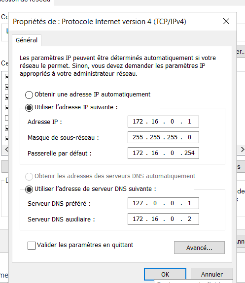


puis dans la page de gestion gere>ajouter role et fonction

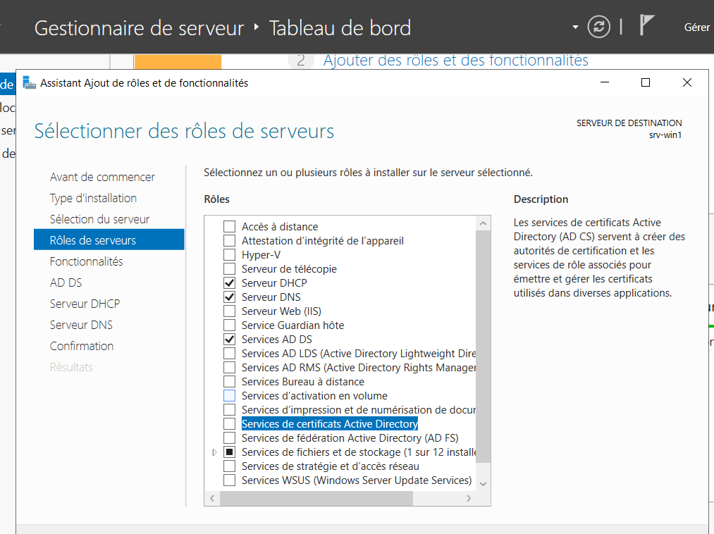

sous win 2025 il faur

puis suivant j usqu à la fin.


sur le 2 emme

C:\Windows\System32\Sysprep

clique droit ouvrir en tant qu admin

puis mettre generaliser et redemarer

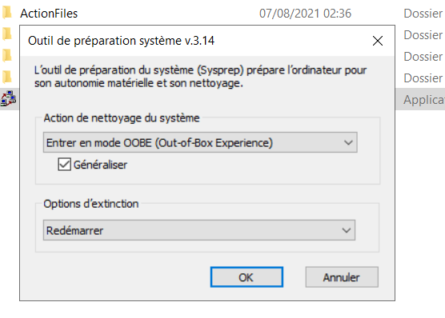


appuyer sur promouvoir

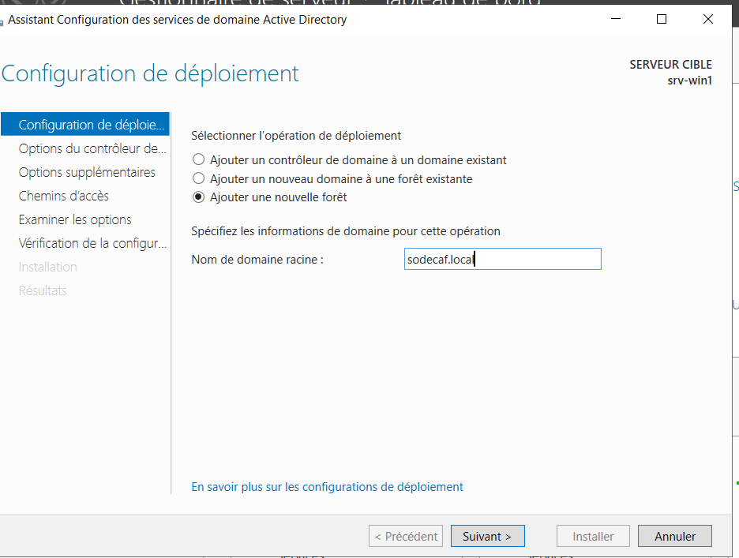

mettre le mdp 
puis suivant partout


sur le serv 2 

change l ip et le nom

172.16.0.2
/24
172.16.0.254

172.16.0.1
172.16.0.2

redemarrage


sur win serv 2 

parametre avance renommage 

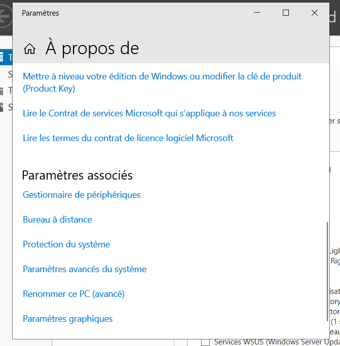


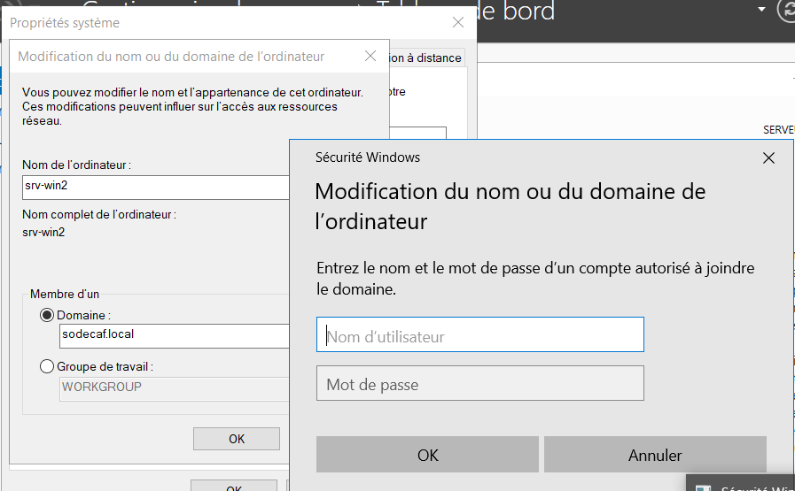

sur win serv 1
terminer le dhcp 
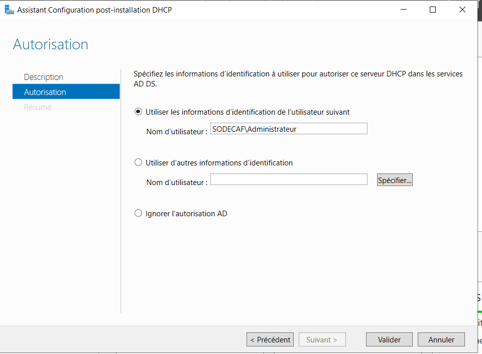

faire ok ok terminer la conf


cliquer dhcp faire une étendue 

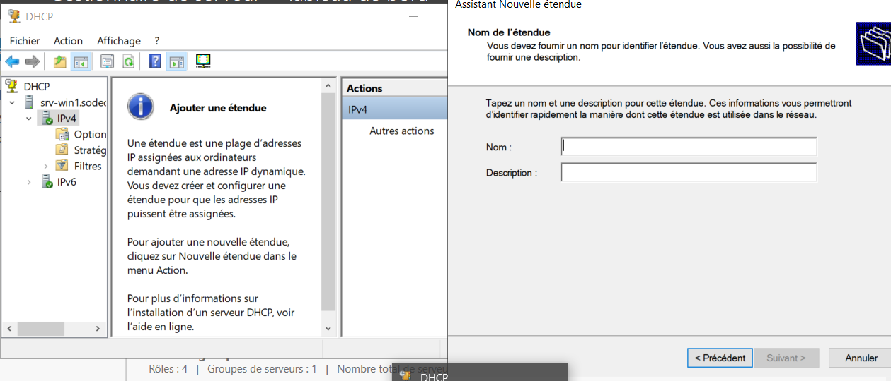

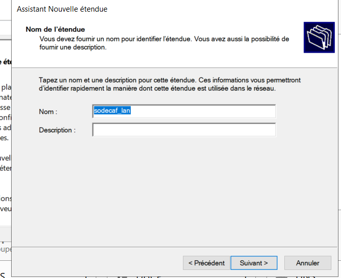


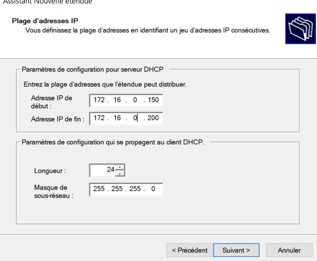
suivant
mettre un 1 pour les jours
oui
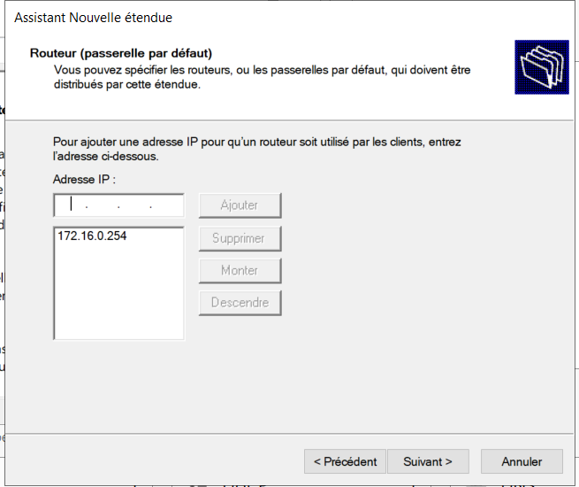
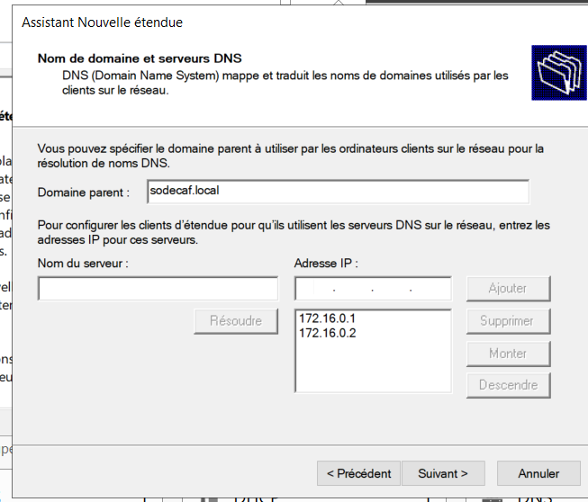

puis suivant suivant

dans l annuiaire

faire une uo


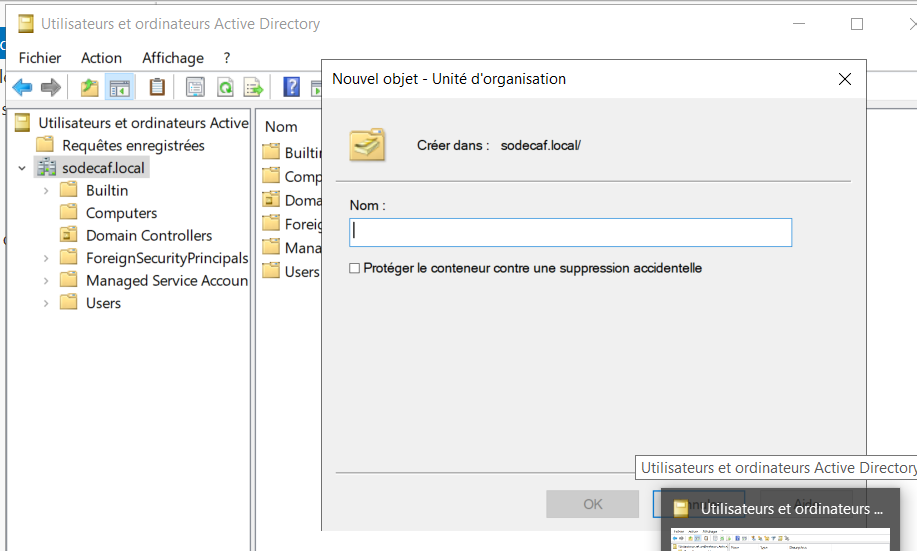

prendre une machine client
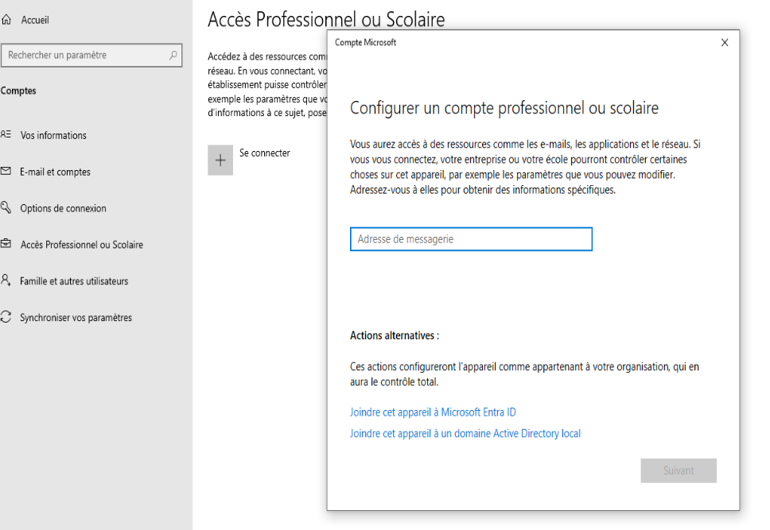


win serv 2

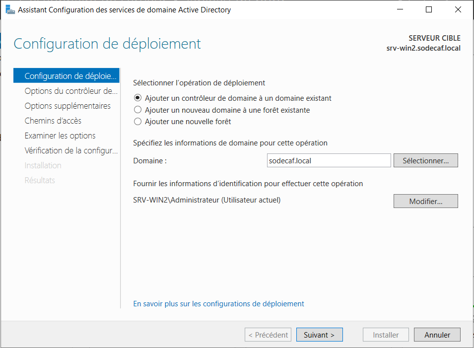

et changer le nom et mdp par celui du domaine
puis suivant et installer
redemare

puis dhcp 
tout ok 

win 1 

confi dhcp

clic droit dhcp

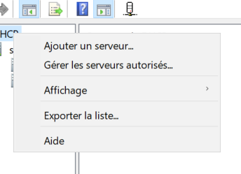

gerer les servs

puis ajouter si le serv n apparait pas

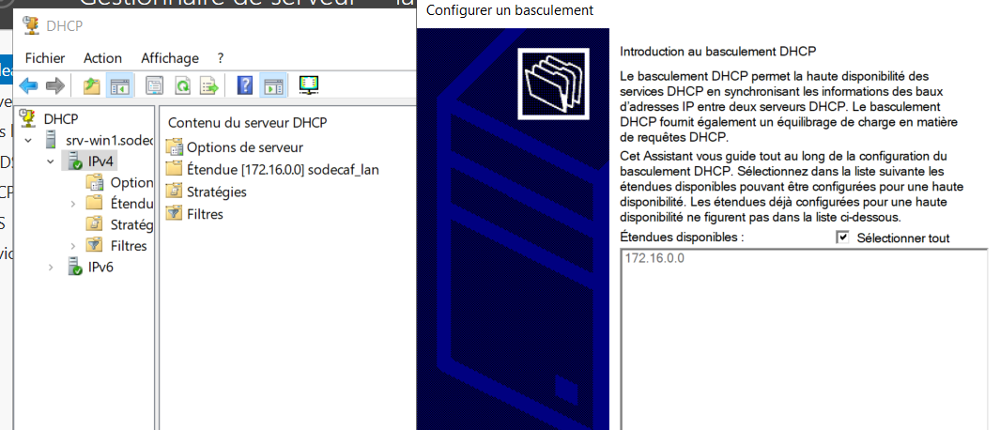

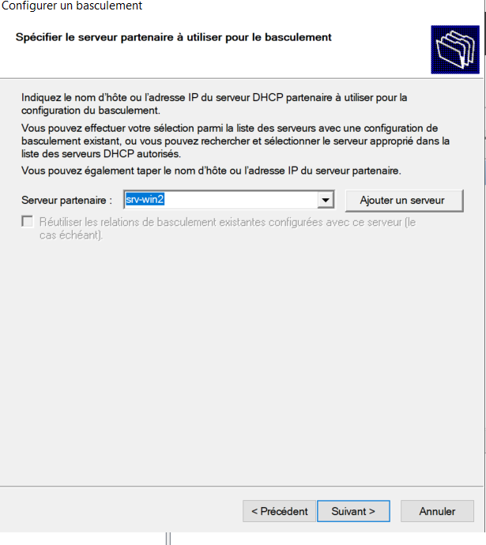

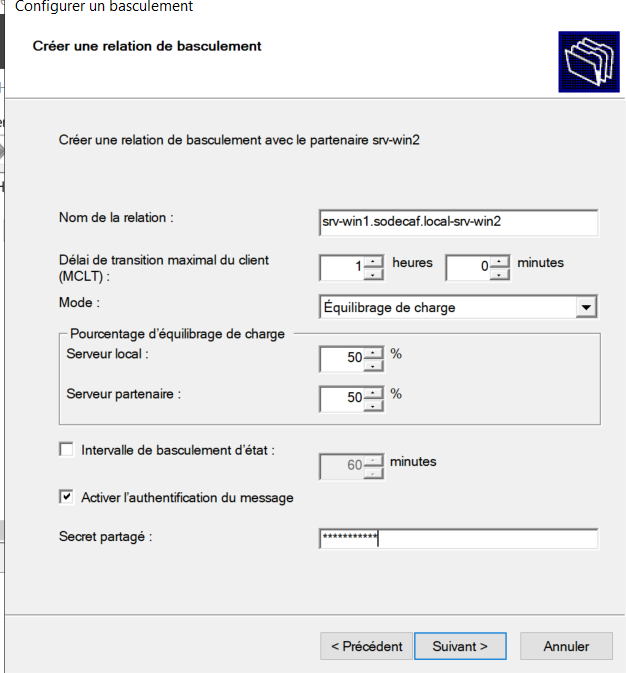
mdp rootsio201
puis ok ok ok 


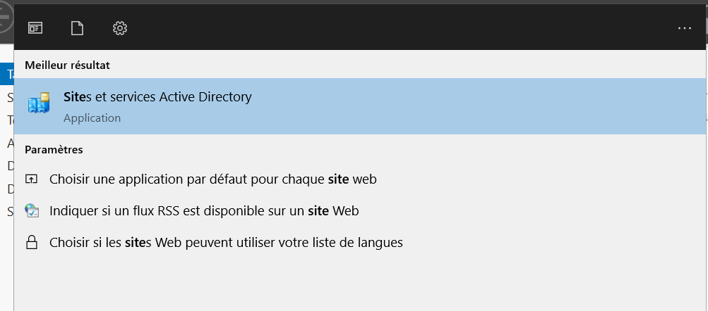
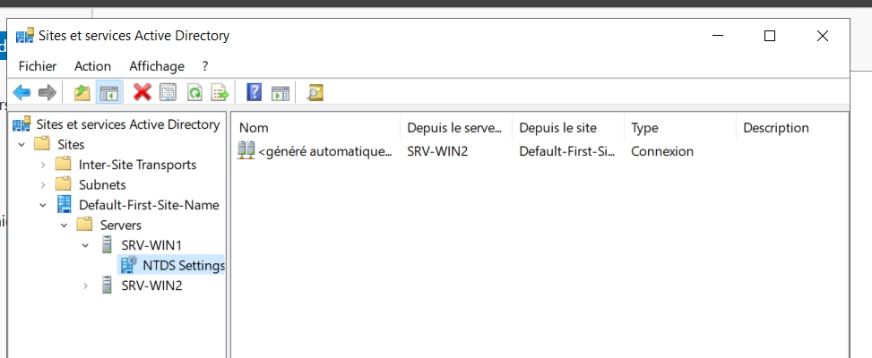


